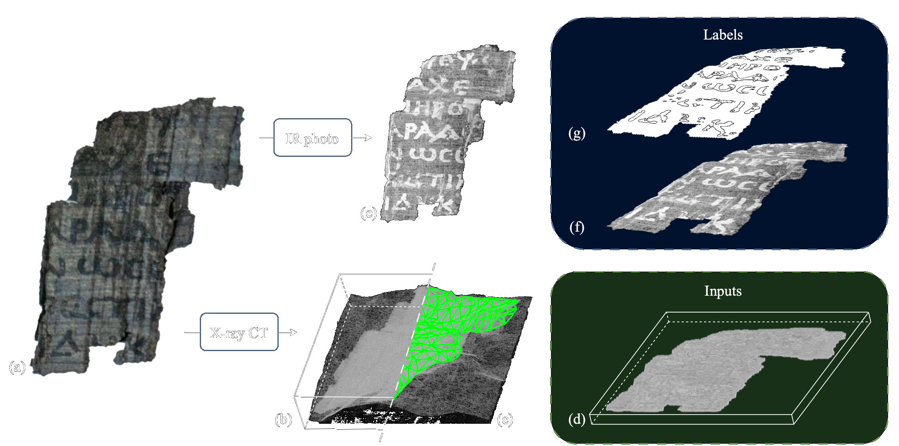

# Vesuvius-Scrolls

This repository contains my submission for the Vesuvius Challenge - Ink Detection, a Kaggle competition that hosts the Ink Detection Progress Prize. The competition is about the sub-problem of detecting ink from 3D X-ray scans of fragments of papyrus which became detached from some of the excavated scrolls.

## Challenge Description

The ink used in the Herculaneum scrolls does not show up readily in X-ray scans, but machine learning models can detect it. Luckily, we have ground truth data. The dataset contains 3D X-ray scans of four fragments at 4µm resolution, as well as infrared photographs of the surface of the fragments showing visible ink. These photographs have been aligned with the X-ray scans, and hand-labeled binary masks indicating the presence of ink in the photographs are also provided.

## Solution Approach

For this challenge, I plan to use Attention U-Net 3D and ConvNext Networks to detect the presence of ink in the X-ray scans. 

## Dataset

The dataset can be downloaded from the [Kaggle competition page](https://www.kaggle.com/c/vesuvius-challenge-ink-detection/data).

### Sample X-ray scan and corresponding infrared photograph

## Requirements

- Python 3.6 or higher
- PyTorch 1.9 or higher
- torchvision
- NumPy
- Matplotlib
- Pandas

## Usage

To train the model, simply run the `train.py` script. To test the model on the test set, run the `test.py` script. The trained model will be saved in the `models` directory.

## Credits

- The dataset for this competition was provided by the [University of Oxford](https://www.ox.ac.uk/)
- [Attention U-Net 3D](https://github.com/fepegar/attention-unet-3d) by Federico Pérez García
- [ConvNext Networks](https://arxiv.org/pdf/2105.08050.pdf) by Anton Osokin, Philipp Krähenbühl, and Cordelia Schmid